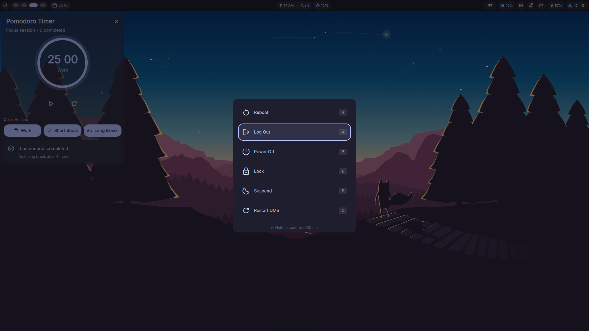
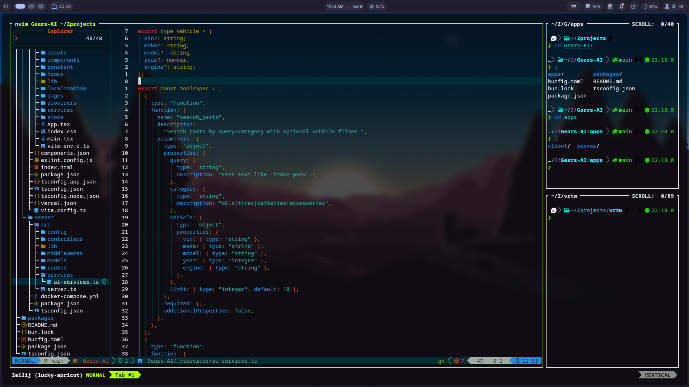
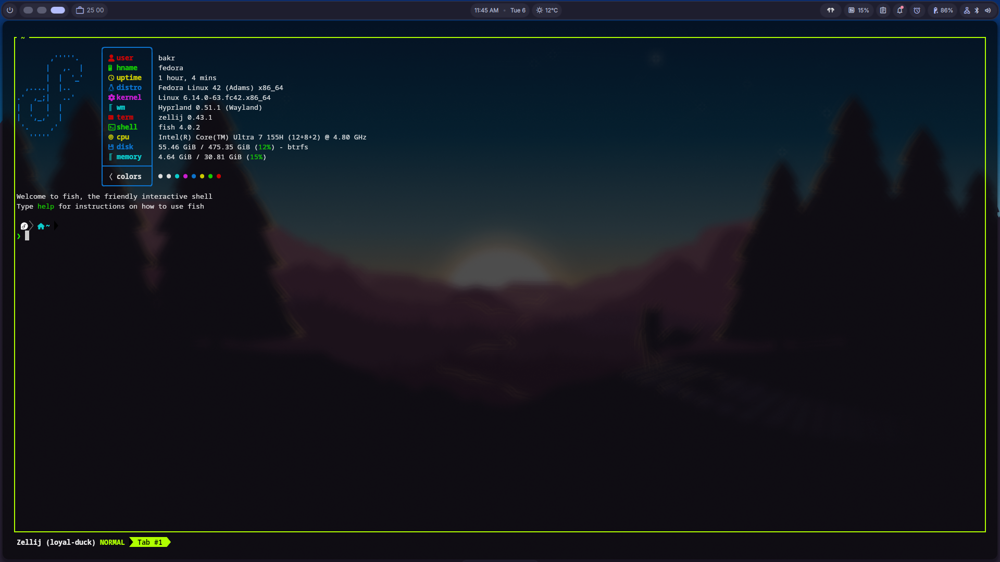

# 🐧 MyLinux4Everything | Hyprland Dotfiles

  
  
  
  
  
  

**A highly customized, aesthetic, and workflow-oriented Hyprland configuration.**

 

## 🚀 Overview

This repository contains my personal configuration files (dotfiles) for a complete Wayland-based desktop environment centered around **Hyprland**. It is designed to be lightweight yet feature-rich, focusing on a seamless workflow.

---

## 🖼️ Gallery

  
  
   
  
  
<i>Showcasing the Desktop and Lockscreen/DM (Setup 05)</i>

---

## 💻 The Development Experience

### ⚡ Neovim & Zellij

My development workflow is powered by the lethal combination of **Neovim** and **Zellij**. While Neovim handles the code, Zellij manages the workspace with its modern workspace layout and high-performance multiplexing.
 

### 📊 System Information (Fastfetch)

Everything at a glance. My `fastfetch` is tuned to give me system vitals instantly upon opening the terminal.
 

---

## 📂 Repository Structure

| Directory     | Description                           |
| :------------ | :------------------------------------ |
| `hypr/`       | Core Hyprland window manager settings |
| `nvim/`       | Custom Neovim IDE setup               |
| `fish/`       | Shell configurations & aliases        |
| `kitty/`      | Terminal emulator themes              |
| `scripts/`    | Custom automation & utility scripts   |
| `fastfetch/`  | System information display            |
| `quickshell/` | UI components and bars                |

---

## 🛠️ Software Stack

### 🌐 Browsers & Communication

|                 |             |                   |
| :-------------: | :---------: | :---------------: |
| **Zen Browser** |  **Brave**  | **Google Chrome** |
|   **Firefox**   | **Discord** |   **Telegram**    |

### 💻 Development & Editors

|             |                    |             |                        |
| :---------: | :----------------: | :---------: | :--------------------: |
| **Neovim**  |     **Zellij**     | **VS Code** |       **Cursor**       |
| **Zed IDE** | **Android Studio** | **Postman** | **Ghosty** / **Kitty** |

### ⚙️ Utilities & Productivity

|                |               |             |
| :------------: | :-----------: | :---------: |
| **LocalSend**  | **Bitwarden** |  **CopyQ**  |
| **OnlyOffice** | **LibrePods** | **AnyDesk** |
|  **RustDisk**  | **Timeshift** |   **VLC**   |

### 🎮 Gaming & Media

|           |               |                |
| :-------: | :-----------: | :------------: |
| **Steam** | **TLauncher** | **OBS Studio** |

   
  Built by <a href="https://github.com/ba7rIbrahim">ba7rIbrahim</a>

